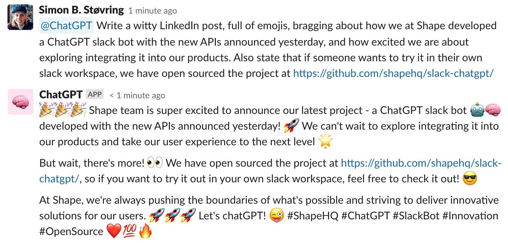
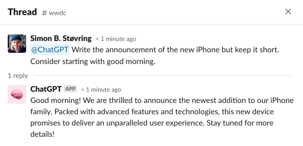
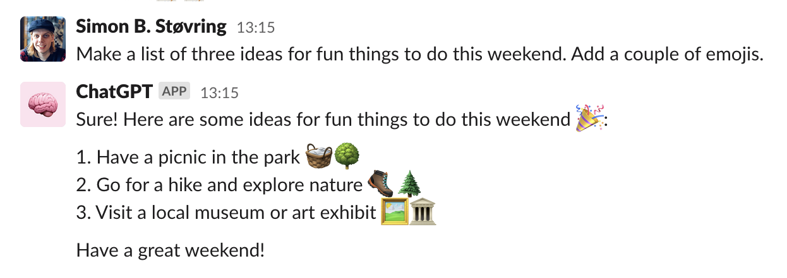
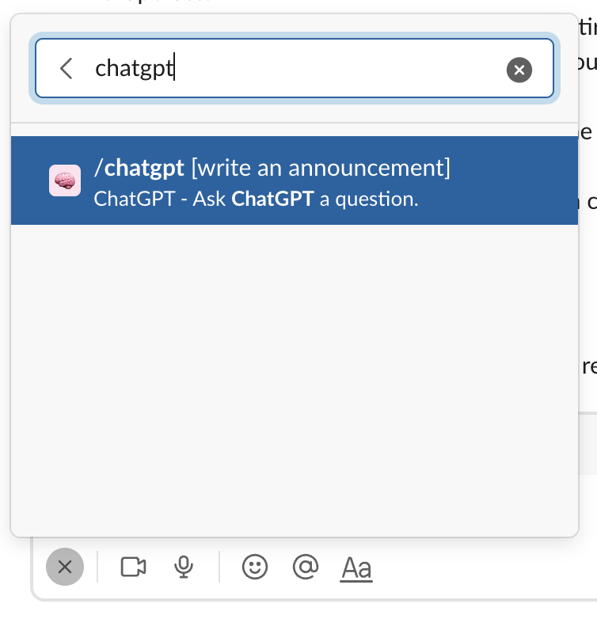
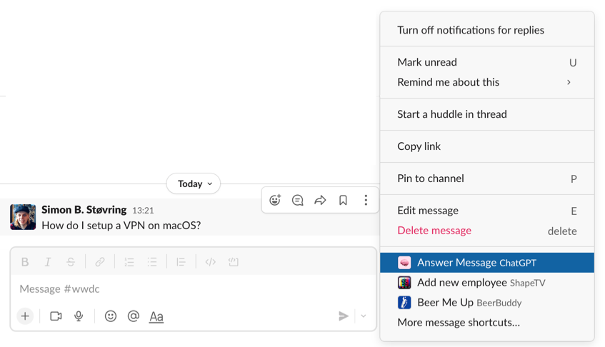
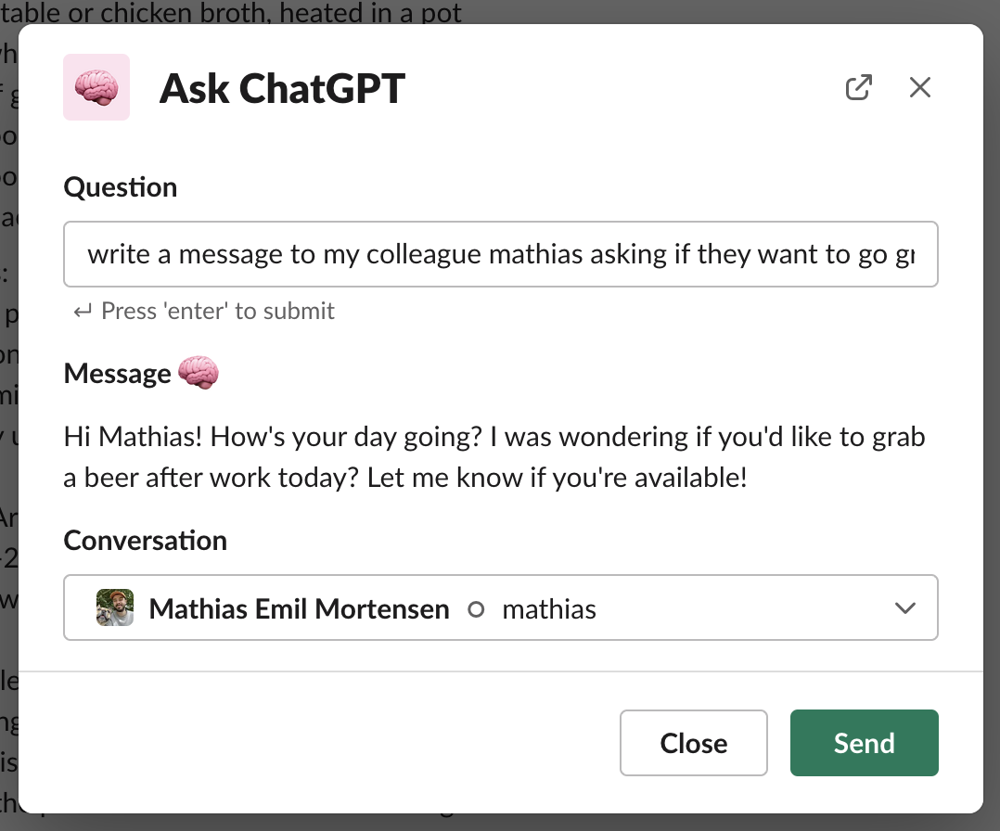

<div align="center">

<h3>Integrate <a href="https://openai.com/blog/chatgpt" target="_blank">ChatGPT</a> into Slack using a Slack app hosted on <a href="https://workers.cloudflare.com" target="_blank">Cloudflare Workers</a>.</h3>

✨ Features&nbsp;&nbsp;&nbsp;•&nbsp;&nbsp;&nbsp;🚀 Getting Started&nbsp;&nbsp;&nbsp;•&nbsp;&nbsp;&nbsp;💻 Running the Project Locally&nbsp;&nbsp;&nbsp;•&nbsp;&nbsp;&nbsp;Built with ❤️ by Shape</div>

## ✨ Features

slack-chatgpt can be used to interact with ChatGPT in several ways on Slack.

#### Mentions

When mentioning the bot, it will post a reply in a thread so it does not clutter the conversation.



#### Direct Messages

People in the workspace can write messages messages to the bot in which case it replies directly within the conversation.



#### Slash Command

Use the slash command to ask ChatGPT a question and have it reply within the conversation.



#### Shortcut on Message

The shortcut on messages can be used to answer a message using ChatGPT.



#### Global Shortcut

The global shortcut can be used to have ChatGPT help you write a message and then send that message to a channel or you can copy the message and send it yourself.



## 🚀 Getting Started

Follow the steps below to get started.

### Create a Cloudflare Worker

The Slack app was built to be hosted on Cloudflare Workers, and as such, we will need to create a worker on Cloudflare Workers.

1. Go to [workers.cloudflare.com](https://workers.cloudflare.com) and create a worker. Choose any name you would like.
2. Take note of the URL of your worker as you will need it when creating a Slack app.

Cloudflare's [wrangler](https://github.com/cloudflare/workers-sdk/tree/main/packages/wrangler) CLI is used to deploy, update, and monitor Cloudflare workers. We will need the CLI later so make sure to install it by running the following command.

```bash
npm install -g wrangler
```

### Register on OpenAI

You will need an OpenAI account to access the ChatGPT API.

1. Register for an account on [platform.openai.com](https://platform.openai.com).
2. Add billing information to your account if you have already used your free credits or they have expired.
3. Generate an API key and save it for later.

### Create a Slack App

The Slack app will be used to listen for request in Slack and post messages back into Slack. In order to support all of slack-chatgpt's features, there are a couple of steps needed. However, you can also choose to setup just the features you need.

Start by creating a Slack app on [api.slack.com/apps](https://api.slack.com/apps). You are free to choose any name for the app that fits your needs.

Make sure to add the Bots feature to the Slack app and add the following scopes:

- `app_mentions:read`
- `chat:write`
- `commands`
- `im:history`
- `chat:write.public`

Take note of your bot's OAuth token and your app's signing secret as you will need [add bot to your Cloudflare worker later](https://github.com/shapehq/slack-chatgpt#add-your-secrets-to-the-cloudflare-worker).

#### Responding to Mentions and Direct Messages

In order for the bot to respond to mentions and direct messages, you must enable Event Subscriptions in your Slack app and pass the URL to your Cloudflare Worker followed by the path `/events`, e.g. `https://slack-chatgpt.shapehq.workers.dev/events`.

Make sure to subscribe to the following events:

- `app_mention`
- `message.im`

#### Enabling the Slash Command

Add a slash command to your Slack app. You are free to choose the command, description, and usage hint that fits your needs but make sure to set the URL to your Cloudflare Worker followed by the path `/commands`, e.g. `https://slack-chatgpt.shapehq.workers.dev/commands`.

#### Adding the Shortcut to Messages

In order to respond to a message using ChatGPT, you must enable interactivity on your Slack app. Make sure to set the URL to your Cloudflare Worker followed by the path `/interactivity`, e.g. `https://slack-chatgpt.shapehq.workers.dev/interactivity`.

Then create a new shortcut and select "On messages" when asked about where the shortcut should appear. You are free to choose the name and description that fit your needs but make sure to set the callback ID to `ask_chatgpt_on_message`.

#### Adding the Global Shortcut

To add the global shortcut to your workspace, you must enable interactivity on your Slack app. You may have already done this when adding the shortcut to messages. When enabling interactivity, you should make sure to set the URL to your Cloudflare Worker followed by the path `/interactivity`, e.g. `https://slack-chatgpt.shapehq.workers.dev/interactivity`.

Then create a new shortcut and select "Global" when asked about where the shortcut should appear. You are free to choose the name and description that fit your needs but make sure to set the callback ID to `ask_chatgpt_global`.

### Add Your Secrets to the Cloudflare Worker

Your Cloudflare worker will need to know your OpenAI API key and the Slack bot's token.

Start by adding the OpenAI API key by running the following command. Paste the API key when prompted to enter it.

```bash
wrangler secret put OPENAI_API_KEY
```

Then add your bot's token running the following command. Paste the token when prompted to enter it.

```bash
wrangler secret put SLACK_TOKEN
```

Finally add the Slack signing secret. Paste the secret when prompted to enter it.

```bash
wrangler secret put SLACK_SIGNING_SECRET
```

### Deploy to Cloudflare

After cloning the repository you can deploy it to Cloudflare by running the following command.

```bash
npx wrangler publish
```

ChatGPT should now be integrated with your Slack workspace.

## 💻 Running the Project Locally

To run the project locally, you will need to create a file named `.dev.vars` that contains your secrets. The content of the file should be as shown below.

```
OPENAI_API_KEY=xxx
SLACK_TOKEN=xxx
SLACK_SIGNING_SECRET=xxx
```

Remember to replace the OpenAI API key and Slack token with your actual credentials.

Then start the server by running the following command.

```bash
npx wrangler dev
```

## Built with ❤️ by [Shape](https://shape.dk)

We built slack-chatgpt at Shape in a couple of hours to try out the ChatGPT APIs when they were published on March 1st, 2023 and are now having a great time asking ChatGPT both serious and silly questions in our Slack 😄

Want to build cool and fun products with us? [We are hiring](https://careers.shape.dk)! 😃🫶
